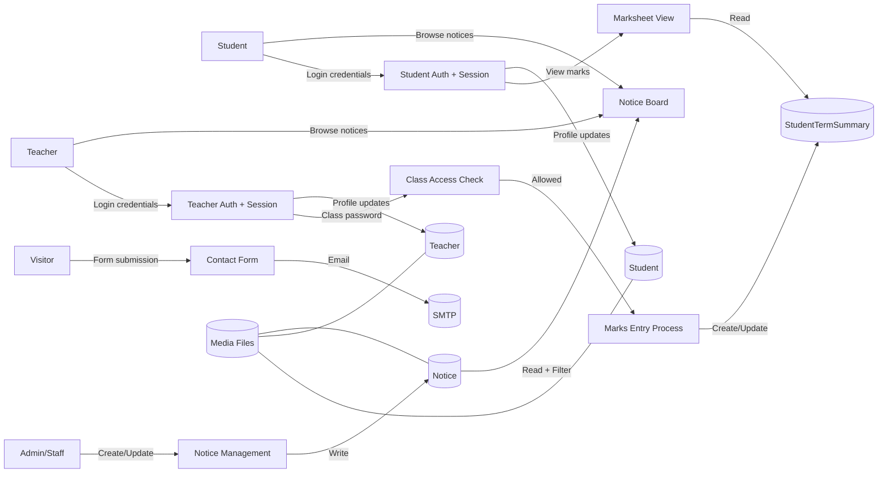

# Marks Portal

A Django-based school portal that combines a public-facing website with student and teacher portals. It includes a marks module, a dynamic notice board, and profile management for students and teachers.

## Key features

- Public website pages (home, about, gallery, contact, notices, section landings).
- Student portal: login, marksheet view, and profile details update.
- Teacher portal: login, dashboard, profile update, class access by password, and marks entry by class.
- Dynamic notice board with categories, urgency highlights, stats, and optional PDF downloads.
- Admin interface for managing notices, students, teachers, and class access.

## DFD (Data Flow Diagram)



## Project structure

```
marks_portal/
  manage.py
  db.sqlite3
  marks_portal/               # Project settings + public pages
    settings.py
    urls.py
    views.py
    models.py                 # Notice model
    admin.py
  student_front_login/        # Student portal
    models.py                 # Student, StudentTermSummary
    views.py
    urls.py
    templates/
  teacher/                    # Teacher portal
    models.py                 # Teacher, ClassAccess
    views.py
    urls.py
    templates/
  templates/                  # Shared public templates
  static/                     # CSS/JS assets
  media/                      # Uploads (notices, student/teacher files)
```

## Data model summary

- Notice: title, content, category, posted_by, date_posted, urgency, active, optional PDF and button text.
- Student: basic profile + credentials and optional image.
- StudentTermSummary: per-student marks for multiple subjects across three terms (theory/practical).
- Teacher: profile + credentials, image, optional CV document, department/role fields.
- ClassAccess: class number and class password for marks entry gating.

## Setup (Windows)

1. Activate your virtual environment (already present as new_project):

   ```powershell
   .\new_project\Scripts\Activate.ps1
   ```

2. Install dependencies:

   ```powershell
   pip install django pillow
   ```

3. Run migrations:

   ```powershell
   python manage.py migrate
   ```

4. Create an admin user (optional but recommended):

   ```powershell
   python manage.py createsuperuser
   ```

5. Start the server:

   ```powershell
   python manage.py runserver
   ```

## Main routes

- Public site: `/`, `/about/`, `/gallery/`, `/contact/`, `/notice/`
- Student portal: `/login/`, `/login/marksheet/`, `/login/details-update/`
- Teacher portal: `/teacher/`, `/teacher/dashboard/`, `/teacher/class-access/<class_number>/`, `/teacher/marks-entry/<class_number>/`
- Admin: `/admin/`

## Marks module access (teacher and student)

- Teachers log in, unlock a class using a class password, then enter marks for each student and term.
- Students log in to view their marksheet, which reads from the same per-student term summary data.

## Dynamic notice board

- Notices are stored in the database with category, urgency, active state, and optional PDF attachments.
- The notice page supports category filters and highlights urgent items.
- Summary stats (total, urgent, this month) are calculated at runtime.

## Notes

- Sessions expire after 30 minutes of inactivity.
- Media uploads are stored under the `media/` folder (images, PDFs).
- Email settings for the contact form are configured in `marks_portal/settings.py`.
